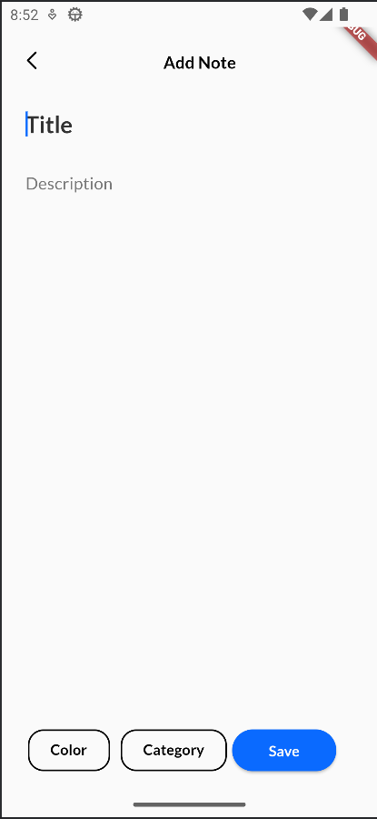
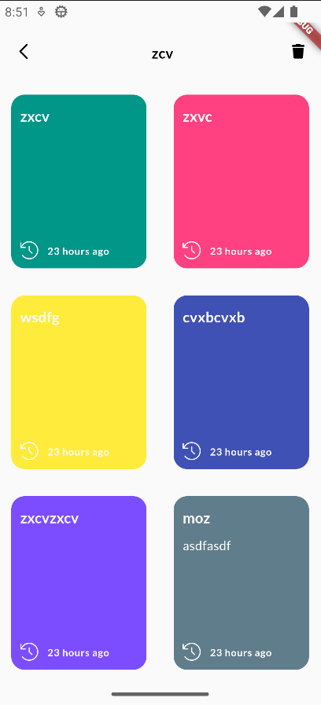
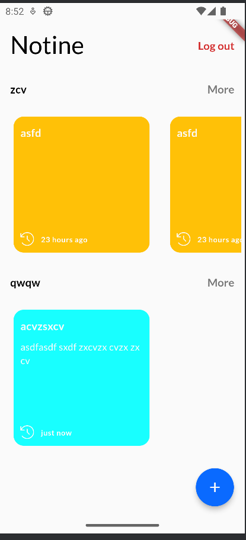

# Notine

Notine is a note-taking application built with Flutter that offers both online and offline capabilities.

## Screenshots

<!-- Add more screenshots as needed -->

## Features

- Create, edit, and delete notes.
- Store notes locally for offline access.
- Synchronize notes with an online database for backup and accessibility from multiple devices.

## Installation

1. Make sure you have Flutter installed. If not, follow the [Flutter installation guide](https://flutter.dev/docs/get-started/install).
2. Clone this repository to your local machine.
3. Navigate to the project directory.
4. Run `flutter pub get` to install dependencies.
5. Connect your device or emulator.
6. Run `flutter run` to launch the application.

## Usage

- Upon launching the app, you'll see a list of existing notes (if any).
- Tap on the '+' button to create a new note.
- Tap on a note to view or edit its content.
- Swipe left on a note to delete it.
- Notes are automatically saved locally and synchronized online when an internet connection is available.

## Contributing

Contributions are welcome! If you'd like to contribute to Notine, please follow these steps:

1. Fork the repository.
2. Create a new branch (`git checkout -b feature/my-feature`).
3. Make your changes.
4. Commit your changes (`git commit -am 'Add new feature'`).
5. Push to the branch (`git push origin feature/my-feature`).
6. Create a new Pull Request.

## License

This project is licensed under the [MIT License](LICENSE).

## Contact

If you have any questions or suggestions, feel free to contact me at [nimiologyy@gmail.com](mailto:nimiologyy@gmail.com).

